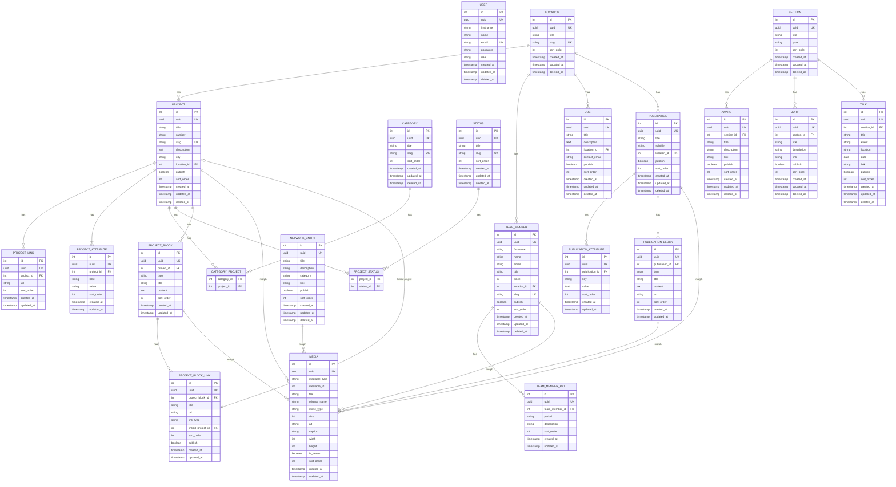

# Entity-Relationship Diagram

```mermaid
erDiagram
    USER {
        int id PK
        uuid uuid UK
        string firstname
        string name
        string email UK
        string password
        string role
        timestamp created_at
        timestamp updated_at
        timestamp deleted_at
    }

    LOCATION {
        int id PK
        uuid uuid UK
        string title
        string slug UK
        int sort_order
        timestamp created_at
        timestamp updated_at
        timestamp deleted_at
    }

    PROJECT {
        int id PK
        uuid uuid UK
        string title
        string number
        string slug UK
        text description
        string city
        int location_id FK
        boolean publish
        int sort_order
        timestamp created_at
        timestamp updated_at
        timestamp deleted_at
    }

    PROJECT_LINK {
        int id PK
        uuid uuid UK
        int project_id FK
        string url
        int sort_order
        timestamp created_at
        timestamp updated_at
    }

    PROJECT_ATTRIBUTE {
        int id PK
        uuid uuid UK
        int project_id FK
        string label
        string value
        int sort_order
        timestamp created_at
        timestamp updated_at
    }

    CATEGORY {
        int id PK
        uuid uuid UK
        string title
        string slug UK
        int sort_order
        timestamp created_at
        timestamp updated_at
        timestamp deleted_at
    }

    STATUS {
        int id PK
        uuid uuid UK
        string title
        string slug UK
        int sort_order
        timestamp created_at
        timestamp updated_at
        timestamp deleted_at
    }

    CATEGORY_PROJECT {
        int category_id FK
        int project_id FK
    }

    PROJECT_STATUS {
        int project_id FK
        int status_id FK
    }

    MEDIA {
        int id PK
        uuid uuid UK
        string mediable_type
        int mediable_id
        string file
        string original_name
        string mime_type
        int size
        string alt
        string caption
        int width
        int height
        boolean is_teaser
        int sort_order
        timestamp created_at
        timestamp updated_at
    }

    TEAM_MEMBER {
        int id PK
        uuid uuid UK
        string firstname
        string name
        string email
        string title
        int since
        int location_id FK
        string slug UK
        boolean publish
        int sort_order
        timestamp created_at
        timestamp updated_at
        timestamp deleted_at
    }

    TEAM_MEMBER_BIO {
        int id PK
        uuid uuid UK
        int team_member_id FK
        string period
        string description
        int sort_order
        timestamp created_at
        timestamp updated_at
    }

    JOB {
        int id PK
        uuid uuid UK
        string title
        text description
        int location_id FK
        string contact_email
        boolean publish
        int sort_order
        timestamp created_at
        timestamp updated_at
        timestamp deleted_at
    }

    SECTION {
        int id PK
        uuid uuid UK
        string title
        string type
        int sort_order
        timestamp created_at
        timestamp updated_at
        timestamp deleted_at
    }

    AWARD {
        int id PK
        uuid uuid UK
        int section_id FK
        string title
        string description
        string link
        boolean publish
        int sort_order
        timestamp created_at
        timestamp updated_at
        timestamp deleted_at
    }

    JURY {
        int id PK
        uuid uuid UK
        int section_id FK
        string title
        string description
        string link
        boolean publish
        int sort_order
        timestamp created_at
        timestamp updated_at
        timestamp deleted_at
    }

    TALK {
        int id PK
        uuid uuid UK
        int section_id FK
        string title
        string event
        string location
        date date
        string link
        boolean publish
        int sort_order
        timestamp created_at
        timestamp updated_at
        timestamp deleted_at
    }

    NETWORK_ENTRY {
        int id PK
        uuid uuid UK
        string title
        string description
        string category
        string link
        boolean publish
        int sort_order
        timestamp created_at
        timestamp updated_at
        timestamp deleted_at
    }

    PROJECT_BLOCK {
        int id PK
        uuid uuid UK
        int project_id FK
        string type
        string title
        text content
        int sort_order
        timestamp created_at
        timestamp updated_at
    }

    PROJECT_BLOCK_LINK {
        int id PK
        uuid uuid UK
        int project_block_id FK
        string title
        string url
        string link_type
        int linked_project_id FK
        int sort_order
        boolean publish
        timestamp created_at
        timestamp updated_at
    }

    PUBLICATION {
        int id PK
        uuid uuid UK
        string title
        string subtitle
        int location_id FK
        boolean publish
        int sort_order
        timestamp created_at
        timestamp updated_at
        timestamp deleted_at
    }

    PUBLICATION_ATTRIBUTE {
        int id PK
        uuid uuid UK
        int publication_id FK
        string key
        text value
        int sort_order
        timestamp created_at
        timestamp updated_at
    }

    PUBLICATION_BLOCK {
        int id PK
        uuid uuid UK
        int publication_id FK
        enum type
        string title
        text content
        string url
        int sort_order
        timestamp created_at
        timestamp updated_at
    }

    LOCATION ||--o{ PROJECT : has
    LOCATION ||--o{ TEAM_MEMBER : has
    LOCATION ||--o{ JOB : has

    PROJECT ||--o{ PROJECT_LINK : has
    PROJECT ||--|{ PROJECT_ATTRIBUTE : has
    PROJECT ||--o{ CATEGORY_PROJECT : has
    PROJECT ||--o{ PROJECT_STATUS : has
    PROJECT ||--o{ PROJECT_BLOCK : has
    PROJECT ||--o{ MEDIA : "morph"

    PROJECT_BLOCK ||--o{ PROJECT_BLOCK_LINK : has
    PROJECT_BLOCK ||--o{ MEDIA : "morph"
    PROJECT_BLOCK_LINK ||--o| PROJECT : "linked project"
    CATEGORY ||--o{ CATEGORY_PROJECT : has
    STATUS ||--o{ PROJECT_STATUS : has

    TEAM_MEMBER ||--o{ TEAM_MEMBER_BIO : has
    TEAM_MEMBER ||--o{ MEDIA : "morph"

    NETWORK_ENTRY ||--o{ MEDIA : "morph"

    SECTION ||--o{ AWARD : has
    SECTION ||--o{ JURY : has
    SECTION ||--o{ TALK : has

    LOCATION ||--o{ PUBLICATION : has
    PUBLICATION ||--o{ PUBLICATION_ATTRIBUTE : has
    PUBLICATION ||--o{ PUBLICATION_BLOCK : has
    PUBLICATION ||--o{ MEDIA : "morph"
    PUBLICATION_BLOCK ||--o{ MEDIA : "morph"
```
